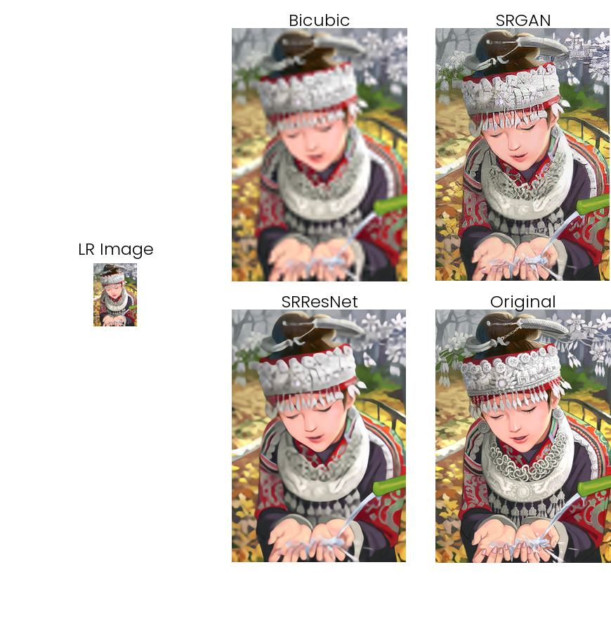
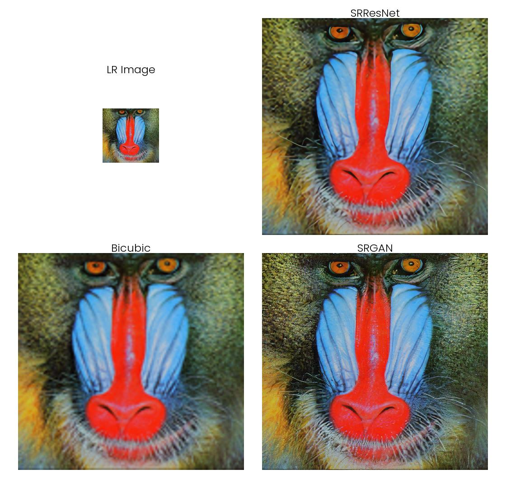
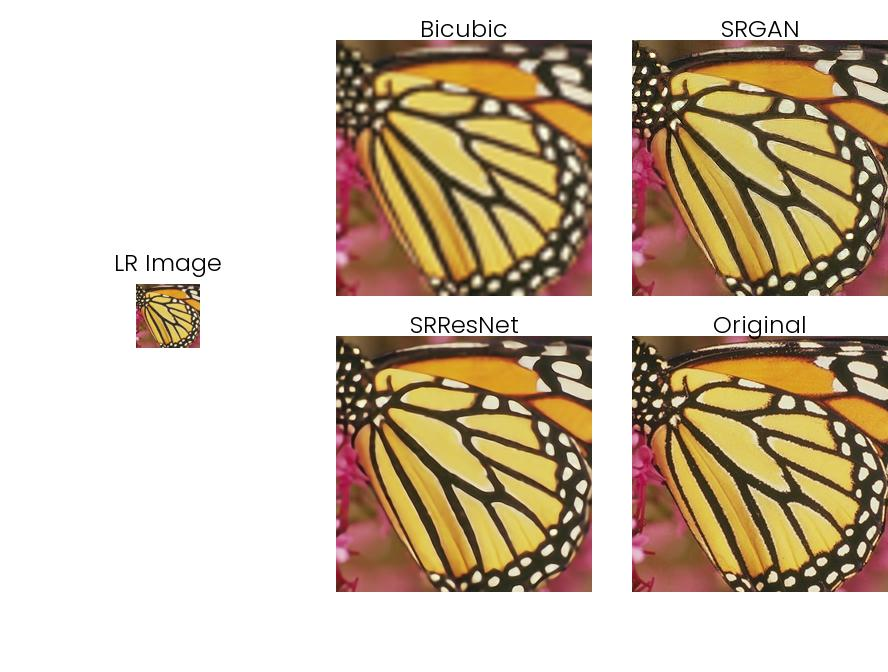
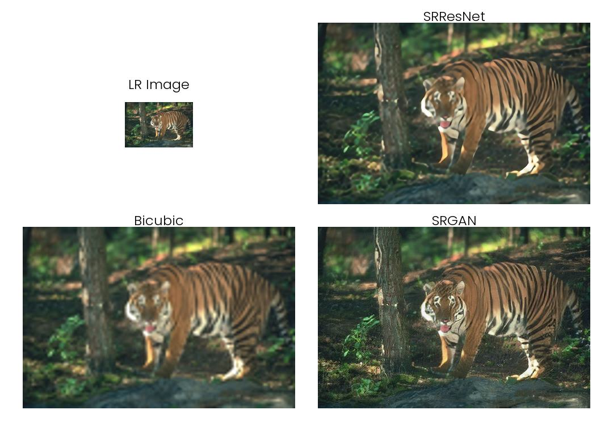

## For Local:
To test you need to download models from [drive](https://drive.google.com/drive/folders/1Uk03u-OPgSZCdK0lXaFd_6lNlm7tJGLE?usp=sharing) add the models folder to root.

### When using High-Res Image to Test the Model:
To check with a high-res image, "main.ipynb" will downsample the images by 4 times and upsapmle it with various methods to provide grid of images for comparison like this:

### When using Low-Res Image to test the model:
To upsample a low-res image 4 times use the "super resolve.ipynb" notebook and follow the comments and you will get result like:

## For Colab:

### When using High-Res Image to Test the Model:
To check with a high-res image, use this colab notebook ["main.ipynb"](https://colab.research.google.com/drive/1clUfZNdIcRWku8AoiwQrHeXgnFCAVPo0?usp=sharing) which will downsample the images by 4 times and upsample it with various methods to provide grid of images for comparison like this:

### When using Low-Res Image to test the model:
To upsample a low-res image 4 times use the colab notebook ["super resolve.ipynb"](https://colab.research.google.com/drive/19H_rl5iVgRdaSuprDRYHck827GM0X2XQ?usp=sharing) and follow the comments and you will get result like:

Datset = [COCO Dataset(2014)](https://cocodataset.org/#download)

### Refrences
[_Photo-Realistic Single Image Super-Resolution Using a Generative Adversarial Network_](https://arxiv.org/abs/1609.04802)\
[_a-PyTorch-Tutorial-to-Super-Resolution_](https://github.com/sgrvinod/a-PyTorch-Tutorial-to-Super-Resolution)